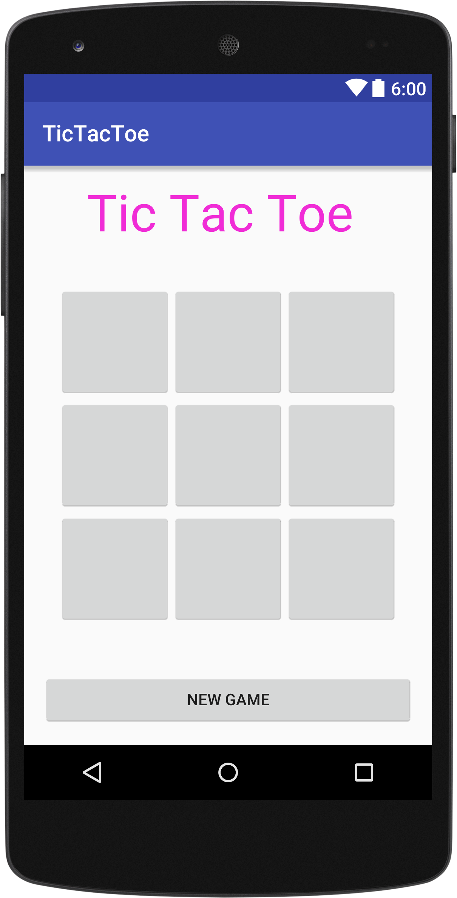

# Tic-Tac-Toe

This is a two-player Tic-Tac-Toe game. When the application is run, the user is shown the opening screen which demands that the two players enter their names. Except the two player name fields are not empty, a toast pops up showing a message to input player names and this prevents the players from playing the game. 

After entering the player names and pressing the "PLAY GAME" button, the games starts and at the end, the winner is displayed.

## Objective

the objective of the game is for one player to get three letters horizontally, vertically or diagonally aligned before the other player. Once the player has reached three letters in a row then the app will automatically congratulate the winner which will bring you to the end of the game.

## Framework

**On the activity_main page, the app uses:**

* TextViews called lblNames, lblPlayer1 and lblPlayer2 to display the "Enter player names information", player 1 and player 2 respectively.
* EditTexts called txtP1 and txtP2 for player 1 and player 2 user inputs respectively.
* Button called btnPlay to navigate to the other activity where the game can be played. A toast is displayed when player 1 and 2 textbox names are empty on click.

**On the activity_game page, the app uses:**

* TextView called txtHeader to display the title of the app as well as give feedbacks on the winner of the game.
* TableLayout called tblLayout with a 3x3 row/column which contains 9 buttons on which the X's and O's are displayed. It helps to organise the buttons.
* Button called btnNew that triggers a new game(that resets the game).

## Screenshots

| Activity_main | Activity_game |
| ------------- |:-------------:| 
|   |  | 

> This was a group project by Taiwo Kareem and Pam Iwalewa. Feel free to use it for anything but please do not sell it.